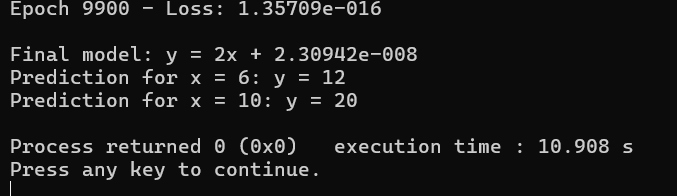

# 📈 Linear Regression from Scratch in C++

A simple implementation of **Linear Regression** using **C++** with **no external libraries**. Ideal for learning how machine learning works under the hood using only the basics of programming.

---

## 🚀 Goal

Train a linear model:

ŷᵢ = m \* xᵢ + c

Where:

- `m` = slope
- `c` = intercept  
  to best fit the training data points `(xᵢ, yᵢ)` by minimizing prediction error.

---

## 🧠 How It Works

### 1. **Loss Function (Mean Squared Error)**

We measure the prediction error using:

J(m, c) = (1/n) \* Σ(mxᵢ + c - yᵢ)²

This tells us how far our model's prediction is from the actual value.

---

### 2. **Gradient Descent Optimization**

To minimize the loss, we compute gradients:

∂J/∂m = (1/n) _ Σ xᵢ (mxᵢ + c - yᵢ)
∂J/∂c = (1/n) _ Σ (mxᵢ + c - yᵢ)

Then update the parameters iteratively:
m = m - α _ ∂J/∂m
c = c - α _ ∂J/∂c

Where `α` is the learning rate (e.g. 0.01).

---

### 3. **Algorithm Pseudocode**

Input:

Training data (x[1..n], y[1..n])

Learning rate α

Epochs E

Initialize:
m = 0, c = 0

Repeat E times:
grad_m = 0
grad_c = 0

For each data point:
prediction = m*x[i] + c
error = prediction - y[i]
grad_m += x[i] * error
grad_c += error

grad_m /= n
grad_c /= n

m -= α _ grad_m
c -= α _ grad_c

yaml
Copy
Edit

---

## 🧪 Example

Training on:
x = [1, 2, 3, 4, 5]
y = [2, 4, 6, 8, 10] // Clearly follows y = 2x

The model should learn:
m ≈ 2
c ≈ 0

Test Predictions:
x = 6 → y ≈ 12
x = 10 → y ≈ 20

---

## 🛠️ Run This in Code::Blocks

1. Open Code::Blocks → Create a new Console C++ Project
2. Paste the code into `main.cpp`
3. Build and Run

No external libraries needed — just standard `iostream` and `vector`.

---

## ✅ Features

- Pure C++ implementation
- Manual gradient descent
- Real-time loss monitoring
- Intuitive and beginner-friendly

---

## 📚 Learnings

- Understand how gradient descent works
- Learn how loss guides parameter updates
- Appreciate the math behind machine learning

---

## 🔖 License

MIT License. Free to use and modify.

Model Overview

Here's how linear regression works:

